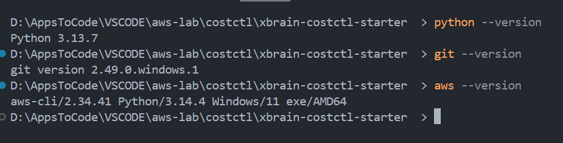
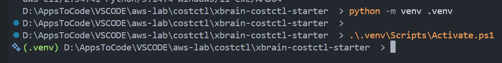
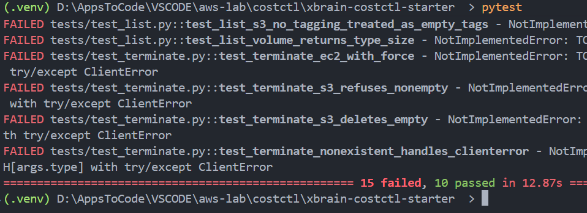
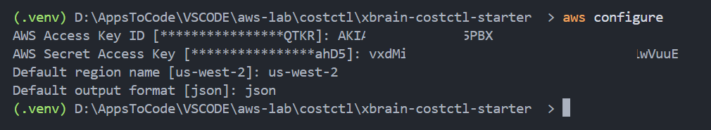
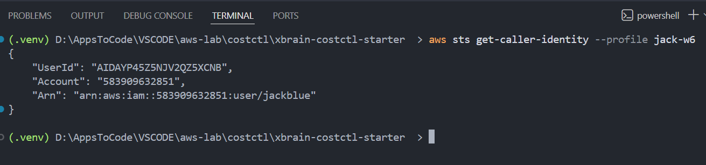

    git clone https://github.com/jackblue19/xbrain-costctl-starter.git

    python --version
    git --version
    aws --version

---

    python -m venv .venv

    .\.venv\Scripts\Activate.ps1

    pip install -r requirements-dev.txt

    pip list

---

    pytest -v

---

    aws configure --profile jack-w6

`us-west-2` & `json`

    aws sts get-caller-identity

    Get-ChildItem Env:AWS*

---

